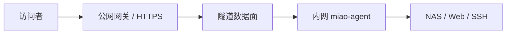

# MiaoTunnel

> 面向个人与小团队的自托管安全内网穿透：轻量客户端、可视化管理、默认安全。

## 当前状态

项目处于方案设计阶段，尚无可用于生产环境的版本。仓库当前用于公开产品边界、技术决策和开发路线，避免一开始重复造协议或堆叠无关功能。

## 想解决什么

已有内网穿透工具往往在两端之间做取舍：

- FRP、rathole 功能或性能成熟，但普通用户仍需理解端口、证书、配置文件和服务守护；
- Cloudflare Tunnel、ngrok 上手快，但依赖第三方平台；
- Pangolin、NetBird 能力完整，但对只想安全发布 NAS、家庭服务或小团队测试环境的用户偏重。

MiaoTunnel 的目标是：**自托管、看得懂、装得上、默认不裸奔。**

## v0.1 只做这些

| 能力 | v0.1 |
| --- | --- |
| 一台公网 Linux 网关 | 支持 |
| Linux / NAS 客户端主动出站连接 | 支持 |
| 发布 HTTP 服务并自动启用 HTTPS | 支持 |
| 发布少量 TCP 服务 | 支持 |
| 一次性注册令牌与设备撤销 | 支持 |
| 中文 Web 管理页、在线状态、基础审计日志 | 支持 |
| 多租户 SaaS、计费、P2P、UDP、移动端 | 暂不做 |

## 首版技术方向

首版不自研传输协议：

- **控制面**：Go 单体服务，提供 Web/API、设备注册、配置下发和审计；
- **数据面**：优先复用 FRP，隔离在适配层后面，后续只有在真实瓶颈出现时才替换；
- **入口与证书**：Caddy，负责域名路由和 ACME HTTPS；
- **存储**：SQLite；单机版不引入 PostgreSQL、Redis 或消息队列；
- **客户端**：单个 miao-agent 守护进程，负责注册、拉取期望配置和监管隧道进程；
- **部署**：公网端提供 Docker Compose；客户端提供单文件二进制与 systemd 安装脚本。

## 数据路径

管理流量和业务流量分开授权。家庭网络不需要开放入站端口；agent 主动连接公网网关。

## 默认安全原则

- 管理面只通过 HTTPS 暴露；
- 注册令牌一次性、短有效期、服务端只保存哈希；
- 每台设备独立身份，可单独撤销和轮换；
- 默认不记录请求正文、Cookie、Authorization 等敏感内容；
- 新建服务默认不公开，必须显式发布；
- 公共 TCP 映射需要额外确认、端口白名单和连接限制；
- 安装包和发布产物必须带校验值，稳定版再增加签名；
- 不提供匿名公共中继，避免项目变成开放代理或滥用基础设施。

## 文档

- [竞品与 GitHub 调研](docs/RESEARCH.md)
- [首版架构与安全边界](docs/ARCHITECTURE.md)
- [开发路线图](ROADMAP.md)
- [安全策略](SECURITY.md)

## 关键结论

MiaoTunnel 不应成为“另一个 FRP”。首版的价值在于把成熟隧道能力包装成一个普通用户能安全部署和管理的产品；只有当复用内核无法满足稳定性、安全隔离或性能目标时，才考虑自研数据面。

## 合法使用

本项目仅用于访问你拥有或已获明确授权的设备与服务。请遵守所在地法律、网络服务商条款和组织安全政策，不得用于未授权访问、隐匿恶意流量或绕过安全控制。

## 许可证

GNU General Public License v3.0。分发本项目或其衍生版本时，应依照 GPLv3 提供相应源代码并保留许可证与版权声明。第三方组件仍遵循各自许可证。
