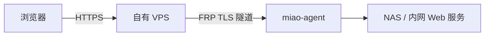

# MiaoTunnel

> 面向 NAS、家庭实验室和小团队的自托管 HTTPS 发布器：轻量 agent、中文管理、默认受保护。

## 当前状态

项目处于方案验证阶段，尚无可用于生产环境的版本。已完成第一轮开源项目、商业产品、复用许可和安全边界调研；下一步先做三个技术 spike，再进入代码骨架。

## 我们到底做什么

用户在自己的 VPS 部署公网网关，在 NAS/Linux 运行 `miao-agent`，然后从 Web 页选择本地 HTTP 服务，得到自有域名下的 HTTPS 地址。

MiaoTunnel 的核心价值不是新协议，而是把 FRP、Caddy、DNS、证书、设备身份和故障诊断组合成普通用户能安全操作的产品。

## 已确定的 v0.1

| 范围 | 决定 |
| --- | --- |
| 用户 | 单管理员；NAS、家庭实验室、小团队 |
| 公网端 | Docker Compose：miao-server + Caddy + frps |
| 内网端 | Linux amd64/arm64 agent + frpc，systemd 运行 |
| 协议 | 只发布 HTTP/HTTPS，支持 WebSocket |
| 域名 | 一个基域名 + wildcard DNS + 每服务显式子域名 |
| 访问 | 默认 Basic Auth，切换公开需明确确认 |
| 身份 | 一次性注册 token、每设备独立凭据、可撤销 |
| 诊断 | DNS、证书、网关、隧道、agent、目标六层状态 |
| 存储/UI | SQLite + Go 服务端 HTML；不做 SPA |

v0.1 不做裸 TCP/UDP、P2P、VPN、计费、多租户、SSO、Kubernetes、高可用、托管节点或静默自动更新。

## 为什么这样选

- **FRP**：成熟且活跃，拥有 TLS、复用、限速和 `Login`/`NewProxy` 服务端授权钩子；
- **Caddy**：自动 HTTPS 和原子配置更新成熟；只为已批准的显式域名签发；
- **SQLite**：单网关单管理员足够，不引入额外运维服务；
- **Go 单体**：控制面、agent 和嵌入页面保持一个易发布技术栈；
- **不 fork Wiredoor**：它证明需求存在，但整套 TypeScript/Vue/NGINX/WireGuard 对首版过重且要求 UDP。

## 安全默认值

- agent 只主动出站；公网只需要 80/443/7000 TCP；
- 新服务默认密码保护，未批准域名不能建隧道或申请证书；
- FRP 插件在执行点核对 agent、service、domain、type 和 generation；
- Caddy/FRP 管理接口不暴露公网；
- token 高熵、短期或每设备独立、只保存摘要、日志脱敏；
- agent 使用本地 target allowlist，不执行远程 shell；
- 不记录 HTTP 正文、Cookie、Authorization 或完整查询串；
- 不提供匿名中继、正向代理或通用网络出口。

## 文档导航

- [深度调研与数据](docs/RESEARCH.md)
- [产品定义与目标用户](docs/PRODUCT.md)
- [v0.1 可执行规格](docs/MVP_SPEC.md)
- [架构与 ADR](docs/ARCHITECTURE.md)
- [威胁模型](docs/THREAT_MODEL.md)
- [复用、许可证与供应链](docs/REUSE.md)
- [开发路线图](ROADMAP.md)
- [安全策略](SECURITY.md)

## 下一步

在写业务功能前，先用最小实验回答：

1. Caddy 管理 Unix socket/隔离网络能否在 Compose 下安全、原子地更新并恢复；
2. FRP 插件能否稳定拒绝伪造 agent、域名和 generation，控制面重启时行为是否 fail closed；
3. 绿联/群晖 Docker 网络下，agent 对宿主机和局域网目标的可达性与错误提示。

验证通过后才建立 Go 模块、数据库迁移、注册 API 和端到端骨架。

## 合法使用

仅用于访问你拥有或已获明确授权的设备与服务。部署者应遵守所在地法律、域名/备案要求、网络服务商条款和组织安全政策。项目不得用于未授权访问、匿名代理、隐藏恶意流量或绕过安全控制。

## 许可证

MiaoTunnel 使用 GNU General Public License v3.0。第三方独立组件仍遵循各自许可证；发布时将提供第三方声明、对应源码和构建信息。

