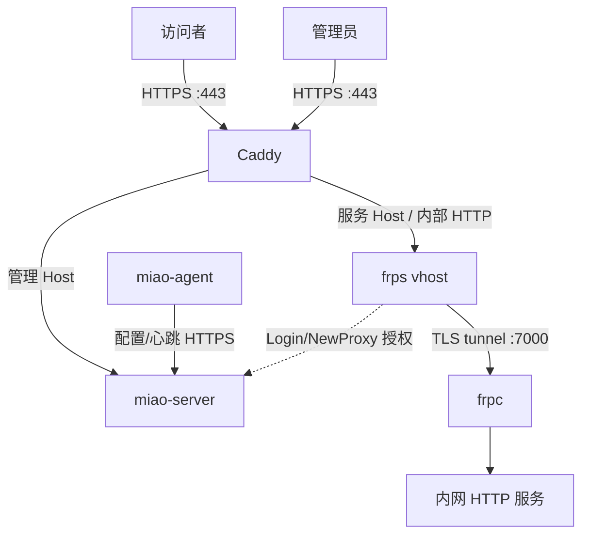

# v0.1 架构与关键决策

## 架构原则

- 一台公网 Linux 主机即可运行；
- 内网不开放入站端口，agent 主动出站；
- 不自研传输协议，不 fork 全栈竞品；
- 控制面、数据面、HTTPS 入口使用明确进程边界；
- 单机版不引入 Redis、PostgreSQL、消息队列、SPA 或微服务；
- 安全控制不能只存在于 Web UI，必须在 FRP/Caddy 执行点再次校验。

## 组件

| 组件 | 职责 | 失败影响 |
| --- | --- | --- |
| `miao-server` | 管理 UI/API、身份、期望状态、FRP 授权插件、Caddy 编排、诊断、审计 | 不能变更配置或授权新代理；现有数据连接尽量继续 |
| SQLite | 单机状态源 | 控制面不可写；不允许退化为放行 |
| Caddy | 80/443、TLS、Basic Auth、Host 路由 | 公网 HTTP 服务不可达 |
| `frps` | 隧道 server 与 HTTP vhost | 所有隧道中断 |
| `miao-agent` | 注册、配置收敛、目标探测、监管 frpc | 该设备服务不可达 |
| `frpc` | 成熟数据面 client | 该设备隧道中断 |

## 数据流

管理请求与业务请求都经 Caddy，但使用不同 Host 和上游。Caddy 在公网终止 TLS，FRP 只接收内部明文 HTTP vhost 和 agent 的 TLS 隧道。

## 控制流程

### 注册

1. 管理员创建短期一次性 token；
2. agent 从 TTY/stdin 读取令牌，通过 HTTPS 换取独立设备 ID/token；令牌不进入命令行或 URL；
3. 服务端只存 token 摘要；agent 以 0600 保存明文；
4. agent 随后拉取空的期望配置并开始心跳；
5. FRP 登录时插件再次验证同一设备状态。

### 发布服务

1. 管理员创建草稿；
2. 服务端规范化 target URL、slug 和访问模式；
3. agent 验证目标属于本地 allowlist 并实际探测；
4. 控制面验证 DNS 与通配子域名；
5. generation 增加，agent 生成并验证 frpc 配置；
6. FRP `NewProxy` 插件核对 agent/service/domain/type/generation；
7. 控制面原子加载包含显式 Host 和 Basic Auth 的 Caddy 配置；
8. 等待证书后执行外部回环检查，更新六层状态。

### 停用与撤销

- 停用服务：先从 Caddy 移除公网入口，再下发 agent 配置并关闭 FRP proxy；
- 撤销 agent：标记 token 无效、拒绝后续 FRP 登录/配置 API，再停用其全部服务；
- 操作可重试且幂等；任一步失败都显示部分收敛状态，不能只显示“已完成”。

## 配置一致性

SQLite 中的 desired state 是唯一事实源。每次改变资源都增加 `generation`：

- agent 只应用比当前新的 generation；
- frpc 通过验证后才原子替换；
- Caddy 使用由全部 enabled 服务生成的完整确定性配置，原子加载；
- observation 单独保存，不反写期望状态；
- 重启后 reconciler 比较 desired/observed 并收敛，不依赖一次性队列。

这样不需要 Redis 或消息队列，也能避免“数据库说已启用、实际路由不存在”的静默漂移。

## 可用性取舍

v0.1 的 FRP 插件只拦截 `Login` 和 `NewProxy`。不拦截每个 HTTP 访客连接，因此：

- miao-server 短时重启时，已注册并运行的 proxy 仍可承接访问；
- 新 agent 登录和新 proxy 在插件不可用时 fail closed；
- 撤销不是瞬时强杀所有既有 TCP 流，控制面需主动关闭 proxy/agent；
- 裸 TCP 的来源 IP allowlist 需要 `NewUserConn`，会带来额外可用性耦合，因此推迟到 v0.2。

## Caddy 管理边界

- 不把 2019 或其他管理端口 publish 到宿主机；
- 优先通过共享权限化 Unix socket；实现 spike 未通过时使用只含 Caddy 和 miao-server 的内部网络；
- 只加载控制面生成的完整配置，不接收用户原始 Caddyfile；
- 不启用无限制 On-Demand TLS；每个域名必须存在于 enabled service；
- 配置失败时 Caddy 保留上一份工作配置，控制面记录 request ID 和脱敏错误。

## Agent 本地边界

- 默认 target 仅允许 loopback 和安装时明确允许的 RFC1918/ULA CIDR；
- 永久拒绝链路本地云元数据地址，除非未来有明确、单独且高风险的开关；
- 不执行远程 shell，不下载运行任意插件；
- 子进程使用固定二进制路径和参数数组，不经 shell 拼接；
- agent 自身本地 API 只监听回环/Unix socket。

## ADR

### ADR-001：FRP 作为 v0.1 数据面

状态：接受。成熟、活跃、Apache-2.0，并具有所需服务端授权钩子。通过独立进程和窄适配层控制依赖。

### ADR-002：v0.1 只支持 HTTP/HTTPS

状态：接受。先完成安全入口、证书和诊断闭环。裸 TCP 需要来源控制、端口池与逐连接授权，移至 v0.2。

### ADR-003：Caddy 显式域名配置，不开放任意签发

状态：接受。每次从 SQLite 全量渲染并原子加载。基域名使用 wildcard DNS，但证书仍按显式服务域名申请。

### ADR-004：Go 单体 + 服务端 HTML + SQLite

状态：接受。v0.1 只有单管理员和单网关，拆服务、SPA、多数据库都不会增加用户价值。

### ADR-005：三进程公网部署

状态：接受。`miao-server`、Caddy、frps 各自独立，Compose 固定版本；agent 与 frpc 在内网主机独立进程运行。

### ADR-006：不静默自更新

状态：接受。只做版本提示；管理员显式升级，验证失败自动回到最后可用配置。

## 待 spike

1. Caddy Unix socket 在官方容器内的权限与重启恢复；
2. FRP 插件超时、frps 重启和 miao-server 重启下的准确行为；
3. `frpc` 动态 API 与“生成配置 + verify + reload”两种方式的故障语义；
4. go-sqlite3 的 amd64/arm64 可复现构建，若 CGO 成本过高再评估纯 Go 驱动；
5. 绿联/群晖 Docker 网络模式下对宿主机和局域网目标的可达性。
