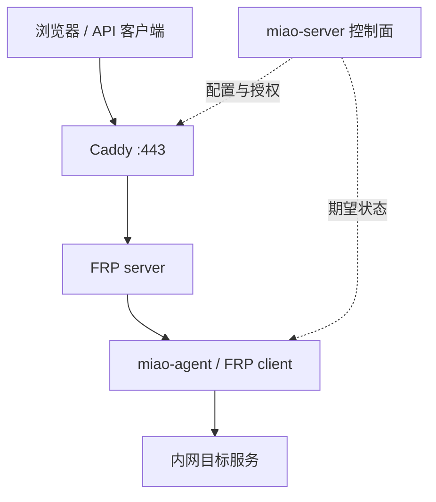

# 首版架构与安全边界

## 设计目标

- 一台公网 Linux 服务器即可部署；
- 家庭或办公网络不开放入站端口；
- agent 安装后，通过一次性令牌完成注册；
- 用户在 Web 页选择设备、本地地址和域名即可发布服务；
- 控制面故障不应立即中断已建立的数据转发；
- 首版优先可审计和可恢复，不追求多节点高可用。

## 非目标

v0.1 不做多租户 SaaS、计费、复杂组织权限、移动客户端、自研隧道协议、全球边缘网络、UDP、P2P 或 Kubernetes Operator。

## 组件

| 组件 | 职责 |
| --- | --- |
| miao-server | 单体控制面；登录、agent 注册、服务配置、期望状态、审计、健康检查 |
| Web UI | 嵌入 miao-server；不单独部署前端服务器 |
| SQLite | 保存用户、设备、服务、域名和审计事件 |
| Caddy | 公开 HTTP/HTTPS 入口、证书和域名路由 |
| FRP server | 隧道数据面；接收 agent 主动建立的连接 |
| miao-agent | 内网守护进程；注册、拉取配置、监管 FRP client、上报状态 |
| 本地服务 | NAS、Web 面板、SSH 或其他已授权服务 |

## 请求路径

HTTP 公网访问经过 Caddy 终止 TLS。TCP 映射使用单独的受限端口池，不与管理面复用。

## 注册流程

1. 管理员在 Web UI 创建一个短期、一次性注册令牌；
2. 用户在内网设备运行 agent，并只向公网网关发起出站连接；
3. agent 用令牌换取独立设备身份；
4. 服务端只保存令牌哈希，令牌使用后立即失效；
5. agent 保存权限受限的设备凭据，后续可轮换或由管理员撤销；
6. agent 拉取期望配置，校验后生成数据面配置并原子替换。

## 配置模型

最小数据对象：

- User：本地管理员账号；
- Agent：一台内网设备及其身份、版本和在线状态；
- Service：本地目标地址、协议、公开方式和状态；
- Domain：域名、验证状态和证书状态；
- Event：谁在何时创建、修改、启停或撤销了什么。

SQLite 使用显式迁移。v0.1 不引入通用插件系统，也不为了未来多数据库预先设计仓储抽象。

## 安全默认值

### 管理面

- 只监听 HTTPS；
- 密码使用现代慢哈希；
- 会话 Cookie 使用 Secure、HttpOnly、SameSite；
- 登录与敏感操作限速；
- Web 请求执行 CSRF 防护；
- 公开测试前加入 TOTP 两步验证。

### agent

- 每台 agent 独立凭据；
- 凭据文件权限限制为当前服务账户；
- 配置下发包含版本号，拒绝回滚到意外旧版本；
- agent 只允许转发管理员明确配置的本机或局域网目标；
- 不接受公网主动发来的管理命令。

### 数据面

- agent 到网关强制 TLS；
- 控制连接与业务连接分离鉴权；
- 公共 TCP 使用端口白名单、连接数和带宽上限；
- 服务默认停用，发布动作必须显式执行；
- 停用或撤销后由服务端和 agent 双向收敛状态。

### 日志

允许记录：时间、设备、服务、连接结果、字节数、错误类型。

默认禁止记录：请求正文、Cookie、Authorization、完整查询参数、用户文件内容和私钥。

## 故障策略

- agent 断线后指数退避重连并加入随机抖动；
- 控制面短时不可用时，已批准的数据面配置继续工作；
- 配置更新采用“写临时文件、校验、原子替换、失败回滚”；
- 连续失败达到阈值后保留最后可用配置并上报告警；
- 证书续期失败提前告警，不在到期时才暴露问题。

## 技术决策记录

### ADR-001：首版复用数据面

状态：接受。

复用 FRP；miao-server 和 miao-agent 只依赖一个最小适配接口。出现以下任一事实后再评估 rathole 或自研：无法实现所需隔离、严重安全缺口无法上游修复、真实压测不达标、依赖导致无法可靠升级。

### ADR-002：控制面使用 Go 单体

状态：接受。

一个进程内提供 API、Web UI、任务循环和 SQLite。首版不拆微服务、不引入消息队列。

### ADR-003：公网端用 Docker Compose

状态：接受。

Compose 同时编排 miao-server、FRP server 和 Caddy。Kubernetes 支持延后到有真实用户需求时。

### ADR-004：v0.1 不做静默自更新

状态：接受。

安装脚本可以检查版本，但升级必须由管理员明确执行。稳定版具备签名与回滚后再考虑自动更新。
