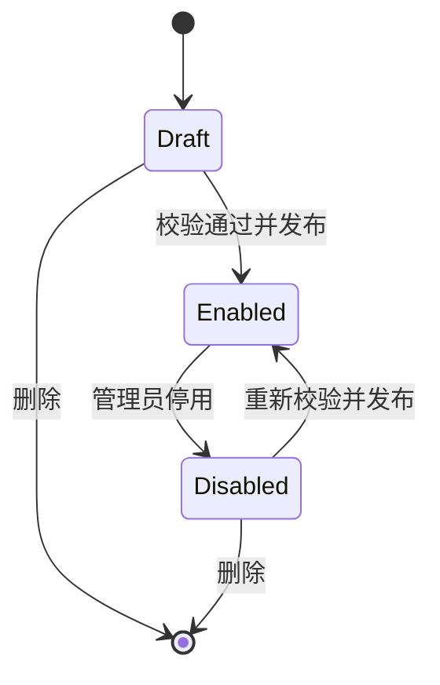

# v0.1 可执行规格

状态：Draft for implementation

## 1. 成功条件

在一台全新 Ubuntu LTS VPS 和一台内网 Linux/NAS 上，用户能在 15 分钟目标时间内完成：部署网关、注册 agent、发布一个受密码保护的 HTTPS 服务、撤销 agent。首次实测前该时间只是产品目标，不是承诺。

v0.1 发布门槛：

- 新环境端到端脚本连续通过；
- 目标、DNS、证书、隧道任一故障都能被区分；
- 手改 frpc 尝试越权发布被服务端拒绝；
- 备份恢复、版本升级失败回滚和设备撤销有演练记录；
- 文档明确处于 beta，不建议发布无自身认证的敏感管理面。

## 2. 部署与端口

公网 Compose 包含 `miao-server`、`frps`、`caddy` 三个服务。

| 端口 | 暴露 | 用途 |
| --- | --- | --- |
| 80/tcp | 公网 | ACME HTTP challenge 与 HTTPS 跳转 |
| 443/tcp | 公网 | 管理 UI/API 和已发布服务 |
| 7000/tcp | 公网 | agent 到 FRP server 的 TLS 数据面 |
| FRP vhost HTTP | 仅容器/回环 | Caddy 到 FRP 的内部上游 |
| Caddy admin | Unix socket 或隔离控制网络 | miao-server 原子加载配置 |
| FRP plugin | 仅容器/回环 | frps 到 miao-server 授权回调 |
| SQLite | 无端口 | 本地数据库文件 |

v0.1 不要求 443/udp、51820/udp 或业务端口池。

## 3. 域名模型

管理员配置一个基域名，例如 `tunnel.example.com`：

- `tunnel.example.com` 指向管理面；
- `*.tunnel.example.com` 指向同一 VPS；
- 服务使用 `slug.tunnel.example.com`；
- 创建服务前解析随机子域名，确认通配 DNS 指向网关；
- Caddy 只加载数据库内的显式主机名，不启用不受限的 On-Demand TLS；
- v0.1 不支持任意自定义域名和通配符证书，避免 DNS provider 插件与凭据管理。

## 4. 数据模型

| 表 | 关键字段 | 约束 |
| --- | --- | --- |
| `admins` | id, username, password_hash, created_at | v0.1 最多一个启用管理员 |
| `sessions` | token_hash, admin_id, expires_at, last_seen_at | 服务端会话，可撤销 |
| `enrollment_tokens` | token_hash, expires_at, used_at, label | 一次性，默认 10 分钟 |
| `agents` | id, name, token_hash, status, version, last_seen_at, revoked_at | name 唯一；token 独立 |
| `services` | id, agent_id, name, slug, target_url, access_mode, desired_state, generation | slug 唯一；仅 HTTP(S) target |
| `service_secrets` | service_id, basic_user, password_hash | 不保存 Basic Auth 明文 |
| `observations` | resource_type, resource_id, layer, state, code, checked_at | 保存最近状态，不堆无限历史 |
| `audit_events` | actor, action, resource, result, detail_redacted, created_at | 只记脱敏元数据 |

迁移为内嵌的顺序 SQL 文件和一张 schema version 表；不引入 ORM 或多数据库抽象。

## 5. 状态机

服务期望状态只有 `draft`、`enabled`、`disabled`；观测状态独立，不能用一个布尔值混合。

`enabled` 不代表可访问。实际状态由六层观测组合：

1. `dns`：域名是否解析到网关；
2. `certificate`：证书是否已签发且有效；
3. `gateway`：Caddy/FRP 是否健康；
4. `tunnel`：FRP proxy 是否存在；
5. `agent`：心跳和配置 generation 是否收敛；
6. `target`：agent 是否能访问本地 URL。

每层返回 `ok | pending | error | unknown`、稳定错误码、最后检查时间和用户动作。

## 6. API 最小集合

API 统一为 `/api/v1`，浏览器使用服务端 session；agent 使用 Bearer token。

| 方法与路径 | 用途 |
| --- | --- |
| `POST /setup` | 仅未初始化实例创建管理员和基域名 |
| `POST /session` / `DELETE /session` | 登录/退出 |
| `POST /enrollment-tokens` | 创建一次性注册 token |
| `POST /agents/enroll` | token 换取设备身份 |
| `GET /agents` | 列表和状态 |
| `POST /agents/{id}/revoke` | 撤销设备 |
| `GET /agent/config` | agent 拉取期望配置，支持 ETag/generation |
| `POST /agent/heartbeat` | 版本、generation 和健康摘要 |
| `POST /agent/observations` | 目标探测和应用结果 |
| `GET/POST /services` | 列表/创建草稿 |
| `PATCH/DELETE /services/{id}` | 修改/删除 |
| `POST /services/{id}/enable` | 预检后发布 |
| `POST /services/{id}/disable` | 移除入口与代理 |
| `GET /services/{id}/diagnostics` | 六层诊断 |
| `POST /internal/frp` | FRP 插件回调；仅内部可达 |
| `GET /healthz` / `GET /readyz` | 进程与依赖健康 |

所有变更 API 接受幂等键或使用资源 generation 防止重复提交。错误返回 `code`、可读中文 `message` 和 `request_id`，不返回内部堆栈。

## 7. agent 行为

- 首次注册的参数只含 `server URL + device name`；enrollment token 从 TTY/stdin 读取，不放入命令行、URL 或环境变量；
- 注册完成后立即清除内存缓冲和任何受控临时文件；
- 长期凭据写入 root-only 文件；
- 以 ETag 拉取配置，指数退避并带随机抖动；
- 先验证目标 URL 与本地 allowlist，再生成 frpc 配置；
- `frpc verify` 通过后写临时文件、原子替换并 reload/restart；
- 更新失败保留最后可用配置，并上报固定错误码；
- 本地管理端口仅绑定 `127.0.0.1` 或 Unix socket；
- agent 不执行服务端传来的任意 shell 命令。

## 8. FRP 集成约束

- 固定并显示 FRP 版本；
- 强制 `transport.tls.force = true`；
- frps 内置 dashboard/API 不暴露公网；
- proxy name 由 MiaoTunnel 生成，格式中只含不可猜测 ID，不信任用户输入；
- `Login` metadata 包含 agent ID、设备 token 和 agent 版本；
- `NewProxy` metadata 包含 service ID 与 generation；
- 插件以数据库期望状态为准，拒绝未知、停用、撤销、类型错误、域名不匹配和旧 generation；
- agent 的 frpc 配置文件 0600，日志过滤 token；
- v0.1 只允许 FRP `http` proxy。

## 9. Caddy 集成约束

- 公开入口只监听 80/443 TCP；
- 控制面渲染完整、确定性的配置并整体原子加载；失败时保留旧配置；
- 管理通道优先使用权限化 Unix socket；若容器实现受阻，只能使用不发布端口的隔离控制网络；
- 每个启用服务有显式 host matcher；上游固定为内部 FRP vhost 端口并保留原始 Host；
- 默认启用 Basic Auth，使用 Argon2id 或 bcrypt 哈希；
- 不信任互联网提供的 `X-Forwarded-*`；只有明确的受信代理 CIDR 可启用；
- 访问日志默认关闭或最小化，不记录 query 与认证头；
- `/data` 持久化以保存 ACME 状态，备份不公开证书私钥。

## 10. 诊断错误码

首版至少稳定支持：

| 错误码 | 含义 | 用户动作 |
| --- | --- | --- |
| `DNS_BASE_MISMATCH` | 基域名未解析到网关 | 修改 A/AAAA，等待 TTL |
| `DNS_WILDCARD_MISSING` | 随机子域名不解析 | 添加 `*` 记录 |
| `ACME_PENDING` | 证书仍在申请 | 等待并检查 80/443 |
| `ACME_FAILED` | 证书签发失败 | 显示脱敏 ACME 原因与重试时间 |
| `AGENT_OFFLINE` | 心跳超时 | 检查 agent 服务和出站 443/7000 |
| `AGENT_REVOKED` | 设备已撤销 | 重新注册，不允许自动恢复 |
| `TARGET_REFUSED` | 目标端口拒绝 | 检查应用监听地址/端口 |
| `TARGET_TIMEOUT` | 目标连接超时 | 检查路由、防火墙和容器网络 |
| `TARGET_DENIED` | 目标不在 agent allowlist | 修改本地 agent 允许网段 |
| `TUNNEL_REJECTED` | FRP 插件拒绝代理 | 检查 service generation 与授权日志 |
| `CONFIG_INVALID` | 新配置验证失败 | 保留旧配置并展示字段级错误 |

## 11. 测试矩阵

| 层级 | 必测场景 |
| --- | --- |
| 单元 | token 生命周期、密码/session、域名规范化、URL/CIDR 校验、状态组合、日志脱敏 |
| 组件 | SQLite 迁移/回滚、FRP plugin 请求、Caddy 配置生成、frpc 原子更新 |
| 端到端 | 注册→发布→证书→访问→停用→撤销；WebSocket；大文件中断恢复 |
| 故障注入 | miao-server/frps/Caddy/agent 分别重启；DNS 错误；目标超时；磁盘满；旧 generation |
| 安全 | CSRF、撞库限速、伪造 metadata、路径/Host 注入、日志 secret 扫描 |
| 平台 | Ubuntu amd64/arm64；至少绿联和群晖或等价 Docker NAS 各一台 |

## 12. 工程验证包络，不是 SLA

首版在 1 vCPU/1 GiB VPS 上至少验证：10 个在线 agent、50 个启用服务、200 个并发 HTTP 请求和 1 小时持续运行。记录 CPU、内存、错误率、吞吐和重连时间并公开原始脚本。

没有测试结果前，README 不写“高性能”“毫秒级”“万级并发”等营销表述。

## 13. 完成定义

- 安装、升级、回滚、备份、恢复、卸载文档齐全；
- 所有端口和持久化卷有清单；
- 威胁模型中的发布前清单通过；
- `THIRD_PARTY_NOTICES.md`、SBOM、校验值随 release 发布；
- 真实 NAS 与公网 VPS 的可重复演练记录进入仓库；
- 已知限制和不支持场景在 UI 与 README 可见。
