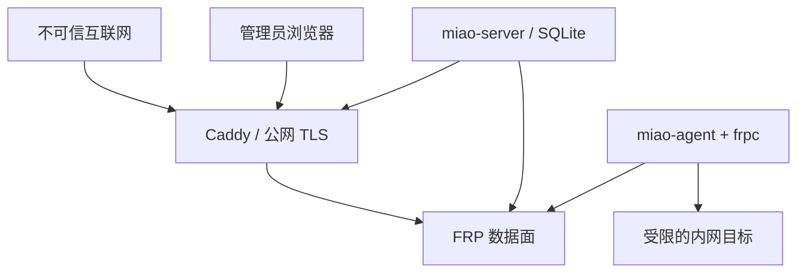

# v0.1 威胁模型

## 范围与安全目标

范围包括单台公网网关、单管理员、多个内网 agent、FRP/Caddy 进程以及被发布的 HTTP 服务。

安全目标：

- 未注册设备不能建立受信隧道；
- 已注册设备只能创建控制面批准的服务；
- 未批准域名不能触发代理或证书签发；
- 撤销设备或停用服务后，不再接受新的登录/代理；
- 数据库、日志和诊断包不泄露明文 token、密码、Cookie 或请求正文；
- 控制面故障时拒绝新授权，不能降级为默认放行；
- 项目不成为匿名中继、开放代理或通用网络出口。

## 信任边界

公网、网关容器网络、agent 主机和目标局域网是不同信任区。Caddy 管理接口、FRP dashboard、本地 agent API 不得进入公网区。

## 资产

- 管理员密码哈希和会话；
- agent 注册 token、长期设备 token、FRP 内部共享 secret；
- 域名、证书私钥和 ACME 账户数据；
- 服务到内网地址的映射；
- 审计、连接元数据和备份；
- 发布二进制、容器镜像和升级渠道。

## 主要威胁与措施

| 编号 | 威胁 | 影响 | v0.1 控制 | 剩余风险 |
| --- | --- | --- | --- | --- |
| T1 | 撞库或会话劫持管理面 | 接管全部服务 | Argon2id、登录限速、Secure/HttpOnly/SameSite、CSRF、防会话固定 | v0.1 单因素；公开测试前加入 TOTP |
| T2 | 注册 token 被截获/重复使用 | 注册恶意设备 | 256-bit 随机、10 分钟、一次性、数据库仅存哈希、HTTPS | 终端历史和剪贴板仍可能泄露 |
| T3 | agent token 泄露 | 冒充单台设备 | 每设备独立 token、文件 0600、可撤销、轮换、审计 | 被攻陷主机在撤销前可使用 token |
| T4 | agent 绕过控制面创建 FRP 代理 | 暴露未批准服务 | FRP `Login`/`NewProxy` 插件校验 agent、service ID、域名、type 和版本 | FRP 插件实现必须 fail closed |
| T5 | 任意域名触发证书签发 | ACME 配额消耗、域名滥用 | 只为数据库中已批准且 DNS 校验通过的显式域名更新 Caddy；不开无限制 on-demand TLS | DNS 变更与重绑定需复查 |
| T6 | 控制面利用 agent 探测整个局域网 | SSRF/横向移动 | agent 本地 allowlist；默认仅 loopback 与管理员配置的私网 CIDR；阻断链路本地元数据地址 | NAS 管理员仍拥有较高本地权限 |
| T7 | 把无认证 NAS 页面公开 | 数据泄露 | 新服务默认 Basic Auth；公开模式明确风险确认；模板标注应用自身认证要求 | Basic Auth 不等于应用级授权 |
| T8 | Caddy/FRP 管理端口暴露 | 网关接管 | 不 publish 管理端口；Caddy API 用权限化 Unix socket或隔离控制网络；FRP dashboard 关闭/回环 | Docker 网络误配置 |
| T9 | 日志泄露凭据或内容 | 隐私泄露 | 不记正文、Cookie、Authorization、完整 query、token；错误统一脱敏 | 上游应用日志不在控制范围内 |
| T10 | 恶意流量消耗 VPS 资源 | DoS/账单风险 | 请求体/超时/连接限制、服务停用开关、网关资源监控 | 单机无法抵御大规模 DDoS |
| T11 | 依赖或更新被污染 | 全链路接管 | 固定版本、校验值、SBOM、扫描、显式升级、可回滚 | 上游供应链仍是信任依赖 |
| T12 | 备份泄露 | 全量配置与凭据泄露 | 备份不含可恢复明文 token；文件 0600；文档要求离线加密 | 用户存储环境不可控 |

## 身份与密钥规则

- 管理员密码：Argon2id，参数写入哈希串并可升级；不自行实现密码学；
- 注册 token：32 字节 CSPRNG，URL-safe 编码，保存 SHA-256，带用途、过期和已用时间；
- 设备 token：32 字节 CSPRNG，只在注册响应显示一次，保存 SHA-256；agent 文件权限 0600；
- 会话 ID：至少 32 字节随机，服务端保存摘要；登录后和权限变化后轮换；
- Caddy/FRP 内部 secret：首次安装生成，不能与设备 token 或管理员密码复用；
- token 不进入 URL query、进程参数、普通日志或审计详情。

## FRP 授权策略

v0.1 订阅 `Login` 与 `NewProxy`：

- `Login`：验证 `metas.agent_id`、`metas.agent_token`、设备状态和允许版本；
- `NewProxy`：除设备身份外，验证 `metas.service_id`、proxy name、type=`http`、唯一域名以及期望配置版本；
- 任何插件超时、非 2xx、解析错误或数据库错误均拒绝；
- v0.1 不订阅每个访问请求的 `NewUserConn`，避免控制面短时重启使已有 HTTP 服务的新访客全部失败；
- 停用服务时同时移除 Caddy 路由、更新 agent 期望状态，并在 FRP 侧关闭代理，不能只改 UI 状态。

## 数据和日志最小化

允许长期记录：操作者、设备/服务 ID、事件类型、结果、粗粒度错误码、时间。

默认不记录：

- HTTP 请求/响应正文；
- Cookie、Authorization、Basic Auth 明文；
- URL 完整查询串；
- 注册 token、设备 token、FRP token；
- NAS 文件名和应用数据；
- 证书私钥。

连接来源 IP 若为诊断或滥用处置所需，应设置短保留期并允许关闭。

## 滥用与合规边界

- 仅访问自己拥有或得到明确授权的设备与服务；
- 不提供匿名注册、公开共享网关或通用正向代理；
- 不以跨境 VPN、隐藏来源或绕过网络控制为宣传和产品能力；
- 部署者负责域名、备案、电信业务和内容等所在地要求；
- 默认给出端口最小化、防火墙、更新和停用指引。

## 发布前安全验收

- [ ] 未授权/过期/已用注册 token 全部失败；
- [ ] 被撤销 agent 无法重新登录或创建代理；
- [ ] frpc 手工添加未批准域名被插件拒绝；
- [ ] Caddy/FRP/SQLite 管理端口从公网不可达；
- [ ] CSRF、会话固定、暴力登录、开放重定向有回归测试；
- [ ] 诊断包和日志经过 secret 检测；
- [ ] 依赖、镜像、SBOM 与校验值产物可复现；
- [ ] 备份恢复和失窃设备撤销演练完成。

